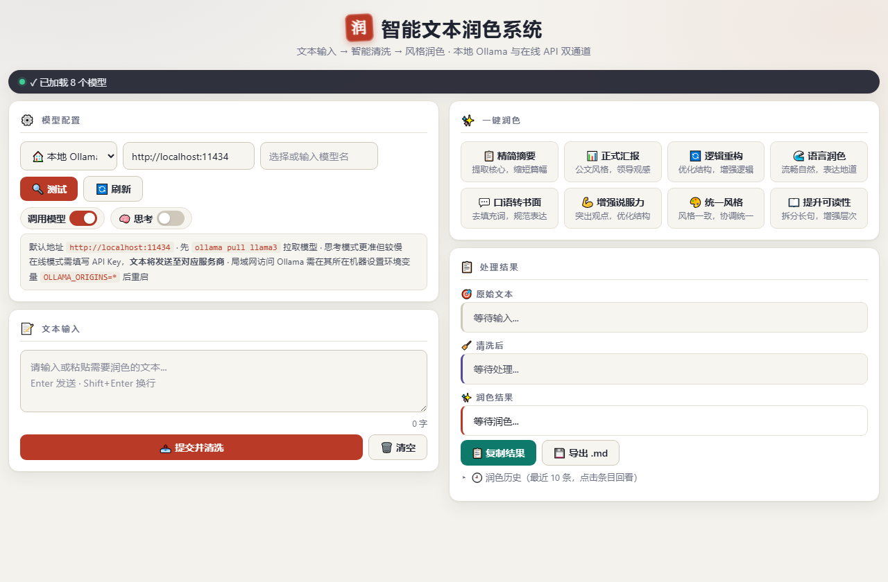
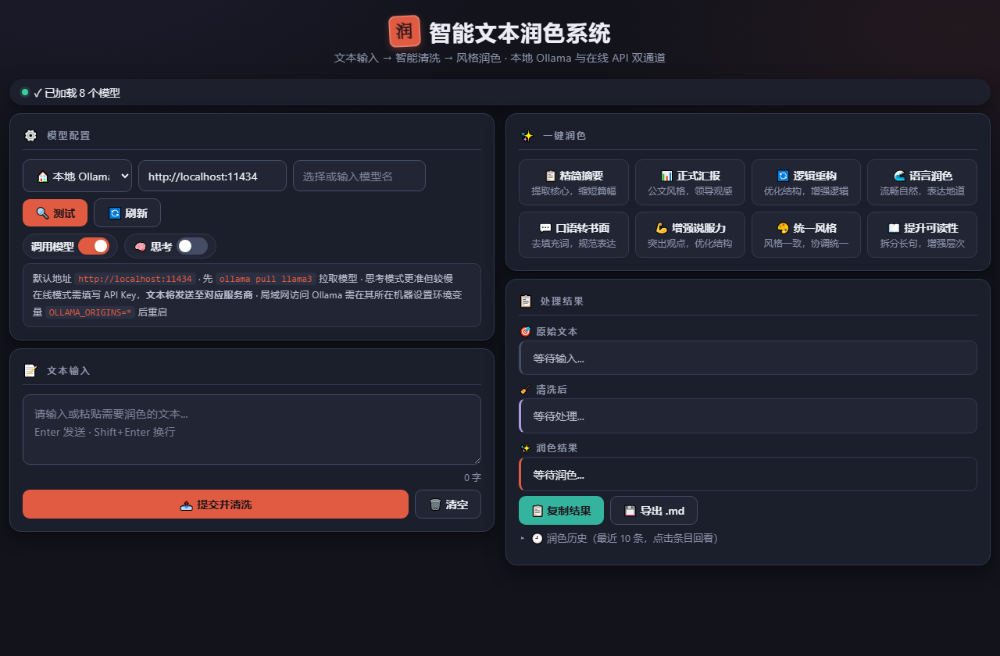

# 智能文本润色系统 (AI Vocabulary Polisher)

> 基于 Web 的本地化文本润色工具。调用本地 Ollama 大模型 API，实现「文本输入 → 智能清洗 → 风格润色」一站式处理。**除连接 Ollama 外无任何外网依赖，数据处理全程留在本地，保障隐私安全。**

---

## 目录

- [一、系统简介](#一系统简介)
- [二、环境要求](#二环境要求)
- [三、快速启动](#三快速启动)
- [四、功能说明](#四功能说明)
  - [4.1 模型配置](#41-模型配置)
  - [4.2 在线 API 通道](#42-在线-api-通道)
  - [4.3 文本输入与清洗](#43-文本输入与清洗)
  - [4.4 一键润色（8 种风格 + 自定义）](#44-一键润色8-种风格--自定义)
  - [4.5 流式输出与停止](#45-流式输出与停止)
  - [4.6 对话上下文](#46-对话上下文)
  - [4.7 实用工具](#47-实用工具)
  - [4.8 界面主题（v2.3）](#48-界面主题v23砚台与朱砂)
- [五、术语表](#五术语表)
- [六、技术架构](#六技术架构)
- [七、常见问题](#七常见问题)
- [八、测试用例](#八测试用例)
- [九、许可证](#九许可证)

---

## 一、系统简介

**核心特性：**

- **零额外依赖**：启动器使用 Windows 自带 PowerShell，无需安装 Python / Node.js
- **完全离线**：JS 库已本地化，除 Ollama 外断网可用
- **双通道服务**：本地 Ollama 与在线 API（DeepSeek / 通义千问 / Kimi / OpenAI）随时切换，统一流式渲染
- **思考模型提速**：未开思考模式时自动 `think:false`，对 qwen3.5/3.8 等思考模型可提速约 19 倍
- **流式渲染优化**：流式阶段纯文本实时显示，完成后一次性 Markdown 渲染，长文本不卡顿
- **XSS 防护**：所有模型输出经 DOMPurify 净化后才渲染
- **防误伤清洗**：口语填充词仅在前置边界删除，长词优先匹配，正文零误伤
- **实用工具**：导出 Markdown、润色历史（10 条）、实时字数统计、暗色模式
- **风格体系（v2.4）**：8 种风格差异化参数与动态长度约束，支持自定义风格、原文对照、多风格横向对比
- **界面主题**：v2.3「砚台与朱砂」文人风，设计令牌化架构，亮/暗双主题自动跟随系统

---

## 二、环境要求

| 依赖 | 说明 |
|------|------|
| Windows 自带 PowerShell | 启动本地 HTTP 服务器（系统自带，无需额外安装） |
| Ollama | 本地大模型运行环境（[安装地址](https://ollama.com)） |
| 已安装的模型 | 如 `qwen3.5:2b`、`llama3` 等（运行 `ollama pull <模型名>` 拉取） |
| 在线 API Key（可选） | 仅「☁️ 在线 API」模式需要，任选 DeepSeek / 通义千问 / Kimi / OpenAI 之一 |
| 浏览器 | Chrome / Edge（推荐） |

> 无需 Python、Node.js 或任何 CDN。`lib/` 目录已内置 marked.js 与 DOMPurify。本地模式断网可用；在线模式需能访问对应服务商的网络。

---

## 三、快速启动

1. **启动 Ollama 服务**：`ollama serve`（或 Ollama 桌面端自动启动）
2. **拉取模型**（首次使用）：`ollama pull qwen3.5:2b`（也可拉取 `llama3`、`qwen3.8:9b` 等）
3. **双击运行 `start.bat`**（默认端口 12580，自定义端口：`start.bat 8080`）
4. 浏览器自动打开 `http://localhost:12580`（如未自动打开，手动输入该地址）
5. 点击「🔍 测试」验证 Ollama 连接，选择模型，输入文本，选择润色风格
6. （可选）在「服务类型」下拉框切换为「☁️ 在线 API」，选择服务商并填入 API Key，即可使用在线模型

> 关闭命令行窗口即停止服务。
> 仅使用在线模式时也建议通过本脚本访问页面（规避直接双击 `index.html` 的 CORS 限制）。

### 注意事项

- **首次调用较慢**：模型首次加载需 10-30 秒，属正常现象
- **端口被占用 / 启动闪退**：改用 `start.bat 8080`，详见 Q5
- **润色无响应**：先确认 Ollama 已启动，详见 Q1；模型列表为空则运行 `ollama pull <模型名>`
- **局域网访问**：需设置 `OLLAMA_ORIGINS=*`，详见 Q6

---

## 四、功能说明

### 4.1 模型配置

| 功能 | 说明 |
|------|------|
| API 地址 | 默认 `http://localhost:11434`，支持自定义 |
| 模型选择 | 点击「刷新模型」自动检测已安装的模型 |
| 测试连接 | 验证 Ollama 服务是否可用 |
| 启用 Ollama | 开关控制是否使用大模型（关闭则用本地算法） |
| 思考模式 | 开启后 `think:true`（先分析再输出，更准但慢）；关闭则 `think:false`（直接输出，对思考模型可提速约 19 倍） |

**配置持久化：** API 地址、模型选择、开关状态自动保存到浏览器 localStorage，刷新页面不丢失。

### 4.2 在线 API 通道

在「服务类型」下拉框切换为「☁️ 在线 API」，服务商预设 DeepSeek / 通义千问 / Kimi / OpenAI / 自定义，选中自动填入 API 地址与候选模型：

- API Key 以密码框输入，仅保存于浏览器 localStorage，不上传任何第三方
- 统一走 OpenAI 兼容协议：`GET /models` 探测连接、`POST /chat/completions` SSE 流式，与本地共用同一套跨包缓冲解析
- 在线模式下「思考模式」开关自动禁用置灰（SSE 协议无 `think` 参数）
- 切换到在线模式时弹出隐私提醒：文本将发送至服务商服务器

**本地与在线如何选择：**

| 场景 | 建议 |
|------|------|
| 敏感 / 涉密文本 | 本地 Ollama（数据不出本机） |
| 追求高质量长文润色 | 在线 API（如 DeepSeek，效果更好、速度更快） |
| 断网 / 内网环境 | 本地 Ollama |

> 隐私提示：在线模式下输入的文本会发送到对应服务商的服务器，请自行评估内容敏感度；API Key 仅保存在浏览器 localStorage，本项目不含任何上报逻辑。

### 4.3 文本输入与清洗

- 在输入框输入或粘贴文本
- 按 `Enter` 提交，`Shift + Enter` 换行
- 点击「提交并清洗」自动去除口语填充词（嗯、啊、那个、然后等），规范化标点

**防误伤清洗：** 语气词（呃/嗯/啊/哦）全局删除；口语填充词（那个/然后/就是说/对吧…）仅在前置边界（句首或标点、空白之后）删除，长词优先匹配，避免「他就是老板」被误删成「他板」。

验证：`呃那个今天天气不错，我们去公园吧。他就是老板，计划很好。` → `今天天气不错，我们去公园吧。` + `他就是老板，计划很好。`

### 4.4 一键润色（8 种风格 + 自定义）

| 风格 | 说明 |
|------|------|
| 精简摘要 | 提取核心内容，缩短篇幅至原文约 35%（动态字数目标） |
| 正式汇报 | 公文风格，适合向领导汇报 |
| 逻辑重构 | 优化结构，使用逻辑连接词增强连贯性 |
| 语言润色 | 修正语法，优化用词，使表达流畅自然 |
| 口语转书面 | 去除口语填充词，转换为规范书面语 |
| 增强说服力 | 突出观点，使用「问题-方案-收益」结构 |
| 统一风格 | 检测并统一全文的用词、句式、语气 |
| 提升可读性 | 拆分长句，使用标题/列表增强层次感 |

点击风格按钮后按钮高亮显示当前选中状态，润色结果以流式方式实时输出。

**v2.4 风格增强：**

- **差异化参数**：按风格自动匹配温度与生成长度上限（摘要/公文求稳用低温度，语言润色/说服力求活用中温度）
- **自适应格式**：精简摘要按原文长度给出量化字数目标；短文本（<100 字）直接输出纯文本，免 Markdown 结构
- **上下文隔离**：切换风格时自动清空此前对话历史，避免不同风格的上下文互相污染
- **自定义风格**：点击「➕ 自定义」，填写名称、图标与系统提示词即可创建专属风格（存于浏览器本地，最多 6 个）
- **原文对照**：「🔀 原文对照」开关，结果区左右分栏同时展示清洗后原文与润色结果
- **多风格对比**：开启「对比模式」后点选多个风格，「⚡ 开始对比」串行生成、分块展示，每块可单独复制，可随时中断

### 4.5 流式输出与停止

- **流式渲染：** 流式阶段用 `textContent` 实时显示纯文本（避免每帧全量 Markdown 解析导致卡顿），完成后一次性渲染为 Markdown 格式
- **渲染节流：** 80ms 时间节流 + `requestAnimationFrame` 合帧，保证流畅
- **停止生成：** 点击「停止生成」按钮可随时中断（`AbortController`），已生成的部分内容会保存
- **Markdown 渲染：** 支持标题、列表、加粗、代码块等完整 Markdown 语法
- **复制结果：** 复制原始 Markdown 文本到剪贴板

### 4.6 对话上下文

系统自动维护最近 5 轮对话历史（10 条消息），让 AI 能理解上下文实现连续交流。点击「清空」重置历史。

### 4.7 实用工具

| 功能 | 说明 |
|------|------|
| 导出 Markdown | 将当前润色结果下载为 `润色结果_时间戳.md` 文件 |
| 历史记录 | 自动保存最近 10 条润色记录（风格 + 时间），点击任意一条可回看内容 |
| 字数统计 | 输入框下方实时显示字符数，长文本一目了然 |
| 复制降级 | 剪贴板 API 不可用时自动降级 `execCommand('copy')`，非安全上下文也能复制 |

> 暗色模式与界面主题详见 [4.8 界面主题（v2.3）](#48-界面主题v23砚台与朱砂)。

### 4.8 界面主题（v2.3「砚台与朱砂」）

v2.3 为纯视觉升级，功能与逻辑零改动。设计主题「砚台与朱砂」，以文人书写意象重构界面。

<p align="center">
  
  
</p>

| 设计要点 | 说明 |
|------|------|
| 设计令牌化 | 全部视觉决策收敛为 `:root` 令牌（约 30 个）；暗色模式为纯令牌覆写（一个 `:root` 块 + 2 条补充规则），双主题天然同步 |
| 朱砂方印 | 标题左侧 40px 旋转方印，内嵌衬线「润」字 |
| 主色 | 朱砂 `#b93a26`（亮）/ `#e05b41`（暗），辅色砚紫 `#55499c` / `#a99ce0` |
| 背景与层次 | 暖纸底 `#f4f2ed` + 双径向辉光；结果框三色左边条区分语义；状态栏深墨胶囊 |
| 无障碍 | WCAG 对比度亮色 5.68:1 / 暗色 4.74:1；`prefers-reduced-motion`、`:focus-visible`、`::selection` 全支持 |

---

## 五、术语表

本文档涉及若干专用术语，首次出现时统一在此说明，后续章节直接引用。

| 术语 | 说明 |
|------|------|
| **Ollama** | 本地大模型运行环境，API 端口 `11434`，通过 `ollama pull` 拉取模型 |
| **在线 API** | 第三方模型服务（DeepSeek / 通义千问 / Kimi / OpenAI），走 OpenAI 兼容协议，需自行提供 API Key |
| **keep_alive** | Ollama 请求参数，指定模型常驻显存时长（`'30m'`），二次调用免重新加载 |
| **num_predict** | Ollama 请求参数，单次生成 token 上限（2048，约 3000 中文字），防止模型发散拖慢 |
| **max_tokens** | OpenAI 兼容协议的等价参数，同为 2048 |
| **think** | 思考模型开关，`think:false` 跳过 qwen3.5 等模型的长篇思考过程，实测提速约 19 倍 |
| **NDJSON** | Ollama 流式响应格式，每行一个 JSON 对象 |
| **SSE** | OpenAI 兼容协议的流式格式，`data:` 行前缀 + `[DONE]` 哨兵 |
| **跨包缓冲区** | 网络分包可能把 JSON 拆开，用 `split('\n')` + `pop()` 把不完整尾行留到下一包拼接，杜绝丢字 |
| **AbortController** | 停止生成按钮的中断机制，中止 fetch/reader，已生成的部分内容保留 |
| **prefers-color-scheme** | 系统暗色模式媒体查询，界面据此自动切换深浅主题 |
| **color-mix()** | CSS 函数，按混合模式从两个颜色派生新颜色（如 `color-mix(in srgb, var(--accent) 32%, transparent)`），使暗色下投影自动跟随主色 |
| **localStorage** | 浏览器持久化存储，API Key、模型选择、开关状态均保存于此，刷新不丢失 |
| **num_ctx** | Ollama 上下文窗口大小（4096），避免长文截断 |

---

## 六、技术架构

```
aivoc/
├── index.html          # 主程序（界面 + 逻辑，纯前端单文件）
├── start.bat           # 一键启动脚本（调用 start.ps1，支持自定义端口）
├── start.ps1           # PowerShell 静态 HTTP 服务器（零依赖，替代 Python）
├── README.md           # 使用说明（本文件）
├── LICENSE             # 版权声明
├── .gitignore          # Git 忽略规则
├── docs/
│   └── CHANGELOG.md    # 版本更新记录
└── lib/
    ├── marked.min.js   # Markdown 解析库（本地化，断网可用）
    └── purify.min.js   # XSS 净化库（本地化，断网可用）
```

### 架构要点

- **纯前端架构：** 无后端，HTML + CSS + JavaScript 单文件
- **零额外依赖：** 启动器使用 Windows 自带 PowerShell（`System.Net.HttpListener`），无需安装 Python / Node.js
- **完全离线（本地模式）：** JS 库本地化，本地模式下除连接 Ollama 外无任何外网请求（无 CDN、无外链字体、无外部图片）
- **双协议流式：** 本地走 Ollama `/api/chat`（NDJSON），在线走 OpenAI 兼容 `/chat/completions`（SSE）；统一跨包缓冲区解析（`split('\n')` 后保留不完整尾行到下一包），网络分包不丢字
- **会话保活：** 请求携带 `keep_alive: '30m'`，页面加载时以 `num_predict: 1` 静默预热模型，配合 `num_ctx: 4096`，二次调用接近秒出
- **思考模型优化：** 请求体携带 `think` 参数，未开思考模式时显式 `think:false`，跳过 qwen3.5/3.8 等模型的长篇思考过程
- **流式渲染策略：** 流式阶段 `textContent`（O(n)），完成后 `marked.parse` + `DOMPurify.sanitize` 一次性渲染，避免 O(n²) 全量解析卡顿；rAF 停摆场景（窗口最小化/遮挡）以 200ms 超时竞速兜底
- **生成长度兜底：** 请求 `num_predict: 2048` / 在线模式 `max_tokens: 2048`（约覆盖 3000 中文字），防止模型发散拖慢
- **XSS 防护：** 所有模型输出经 DOMPurify 净化后才渲染
- **服务器端口：** 默认 12580，可通过 `start.bat <端口号>` 自定义

---

## 七、常见问题

### Q1：点击润色后没反应

1. 按 `F12` 打开控制台查看错误信息
2. 确认 Ollama 服务已启动（浏览器访问 `http://localhost:11434`）
3. 确认模型已安装（终端运行 `ollama list`）
4. 点击「测试连接」验证 API 可达性

### Q2：输出很慢

1. **关闭「思考模式」**：对思考模型（qwen3.5 / qwen3.8）会传 `think:false`，实测可从 11.2s 降到 0.58s（约 19 倍）
2. **选小模型**：如 `qwen3.5:2b`（2.3B），远快于 `qwen3.8:27b`（27B）等大模型
3. 首次调用需加载模型，等待 10-30 秒属正常现象

### Q3：刷新后配置丢失

检查浏览器是否禁用了 `localStorage`（隐私模式下可能不可用）。

### Q4：复制的内容没有格式

复制功能保存的是原始 Markdown 文本，粘贴到支持 Markdown 的编辑器（如 Typora、VS Code）即可保留格式。

### Q5：双击 start.bat 闪退 / 中文乱码

脚本已全英文输出，避免 GBK 乱码。若仍闪退，请在 cmd 中手动运行 `start.bat` 查看错误，常见原因：
- PowerShell 不可用（系统损坏，需修复 Windows Management Framework）
- 端口 12580 被占用（改用 `start.bat 8080`）

### Q6：局域网其他设备访问时润色失败（Failed to fetch / CORS 报错）

Ollama 默认只允许同源请求。局域网场景下页面由 `http://<本机IP>:12580` 提供，而 API 请求发往 `http://localhost:11434`，属于跨域。解决方法：

1. 设置系统环境变量 `OLLAMA_ORIGINS=*`（PowerShell：`[Environment]::SetEnvironmentVariable('OLLAMA_ORIGINS', '*', 'User')`）
2. 完全退出 Ollama（托盘图标右键退出）后重新启动
3. 页面中把 API 地址从 `localhost` 改为运行 Ollama 的机器 IP

### Q7：在线模式和本地模式如何选择？

见 [4.2 在线 API 通道](#42-在线-api-通道)的「本地与在线如何选择」决策表。

### Q8：在线模式下 API Key 保存在哪里？

API Key 仅以明文形式保存在浏览器 `localStorage` 中（键名 `onlineApiKey`），不上传任何第三方服务器，本项目不含任何上报逻辑。Key 输入框本身没有独立的清空按钮——若需清除，点击页面底部的「🗑️ 清空」按钮会连带清空全部内容（含 Key 与模型选择）。服务商预设与隐私处理的完整说明详见 [CHANGELOG v2.2 第六节](docs/CHANGELOG.md#六在线模型接入批次-6)。

### Q9：预热请求会报 `net::ERR_ABORTED` 吗？

不会。v2.2 已修复：预热响应体若始终不被消费，浏览器会将该连接标记中止并报错。修复方式为 `.then(r => r.text())` 显式消费响应体（`num_predict: 1` 的响应仅几十字节，开销可忽略）。修复原理与验证数据详见 [CHANGELOG v2.2 第二节](docs/CHANGELOG.md#二性能会话保活--预热批次-2)。

---

## 八、测试用例

| 用例 | 输入要点 | 操作 | 预期 |
|------|------|------|------|
| 口语转书面 | 多填充词的口语长句（嗯、那个、然后呢、就是说……） | 点击「口语转书面」 | 去除所有口语填充词，语句规范通顺，保留核心意思 |
| 正式汇报 | 随意的口语讨论（"挺好的，应该可以搞""没啥大问题"） | 点击「正式汇报」 | 转为公文风格，语言严谨客观，结构清晰 |
| 精简摘要 | 含进度滞后、预算超支、下月安排三要点的长段汇报 | 点击「精简摘要」 | 长度缩至原文 30%-50%，三个要点全部保留 |

---

## 九、许可证

本项目采用 [LICENSE](LICENSE) 文件声明的许可协议。
